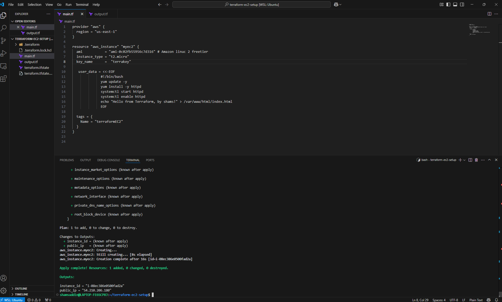
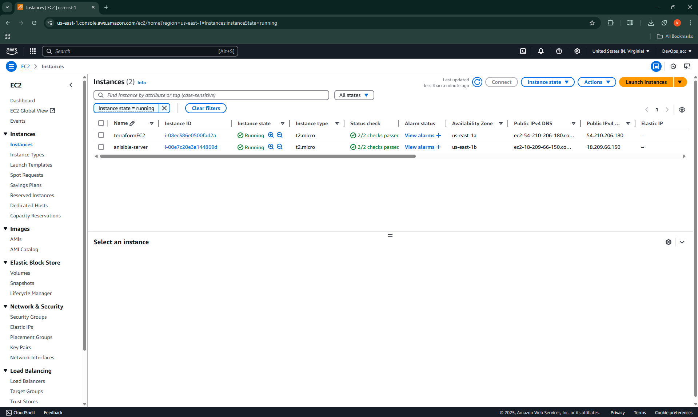

# Terraform EC2 Instance Setup

This project uses Terraform to provision an Amazon EC2 instance. The instance is automatically configured with Apache HTTP server and displays a custom message.

## Prerequisites

- AWS Account
- AWS CLI configured
- Terraform installed
- SSH Key in AWS (used in `key_name`)

## Files

- **main.tf**: Terraform configuration for creating an EC2 instance.
- **output.tf**: Outputs the EC2 instance's ID and public IP.

## Steps to Use

1. Clone this repository:

    ```bash
    git clone https://github.com/k-shamsuddin/terraform-ec2-instance.git
    cd terraform-ec2-instance
    ```

2. Initialize Terraform:

    ```bash
    terraform init
    ```

3. Apply the configuration:

    ```bash
    terraform apply
    ```

    - Confirm by typing `yes` when prompted.

4. After the resources are created, Terraform will display the instance's ID and public IP:

    ```
    instance_id = i-xxxxxxxxxxxxxxxx
    public_ip = xxx.xxx.xxx.xxx
    ```

5. Open the public IP in your browser, and you should see:

    ```
    Hello from Terraform, by Shams!
    ```

6. To destroy the resources:

    ```bash
    terraform destroy
    ```
📸 Screenshots





📍 Key Concepts
Terraform Providers

EC2 Instances in AWS

Infrastructure as Code (IaC)
